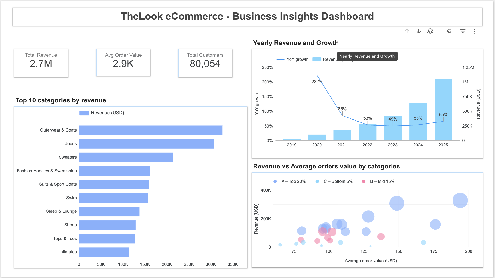
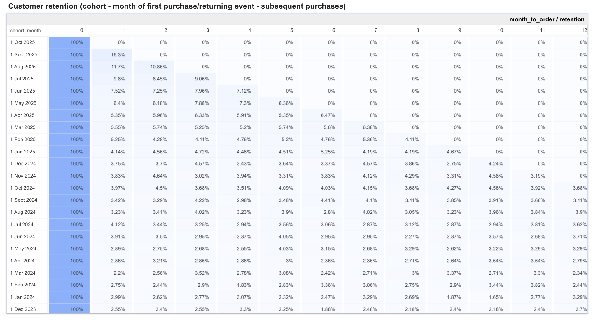

#  TheLook eCommerce – Final Analytics Project

This project analyzes **customer behavior, revenue performance, and retention trends** in an eCommerce environment using the public dataset **TheLook (BigQuery)**.  
The goal was to simulate the workflow of a data analyst - from SQL data modeling in BigQuery to Python analysis in Colab and interactive dashboards in Looker Studio.

##  Project Overview

The analysis explores customer lifecycle, purchase dynamics, and product performance using cohort, RFM, and Pareto frameworks. 

## Analytical Questions
1. How does monthly and yearly revenue evolve (YoY, MoM)?
2. Which product categories drive the most revenue?
3. What share of users are new vs. returning?
4. What is the conversion rate from registration to first purchase?
5. How does customer retention change over time?
6. Which categories have the highest AOV?
7. What share of revenue is generated by top 20% of products (Pareto)?
8. What segments of users (RFM) are most valuable?

##  Data Source

Dataset: [`bigquery-public-data.thelook_ecommerce`](https://console.cloud.google.com/marketplace/product/bigquery-public-data/thelook-ecommerce)  
Environment: **Google BigQuery (SQL)**  
Project dataset:  
my-educational-project-476420.thelook_ecommerce_project

## Data Pipeline & Analytical Tables

All analytical tables were created in **BigQuery** via custom SQL scripts (see `/sql` folder):

| Table | Description |
|-------|--------------|
| **monthly_revenue** | Monthly revenue tracking and YoY/MoM growth. |
| **category_revenue** | Total revenue by product category. |
| **aov_by_category** | Average Order Value (AOV) per category. |
| **new_vs_repeat** | Splits users into new vs repeat buyers. |
| **rfm_base** | Recency, Frequency, Monetary scoring base. |
| **pareto_products** | Pareto 80/20 ranking of top revenue-generating products. |
| **basket_pairs_base** | Base for market-basket analysis (product combinations). |
| **cohorts_base** | Cohort-level mapping of users and orders (used for retention). |
| **cohorts_looker** | Final cohort retention table used in Looker Studio. |
| **conversion_from_reg_to_paying** | Conversion of registered to paying users. |
| **total_customers** | Total active, registered, and paying customers over time. |

Full SQL code for each table is available here:  
[View `/sql/` folder](./sql)

## Python & Colab Notebook

Notebook: [`colab/My_Final_project.ipynb`](./colab/My_Final_project.ipynb)  

Main tasks implemented in Python:

- Connection and authentication to **BigQuery** (`pandas-gbq`, `google.cloud.bigquery`)
- Loading analytical tables into Pandas
- **RFM segmentation** using quantile scoring (`qcut`)
- **Cohort analysis** — calculating month-to-order retention matrix
- Uploading processed tables back to BigQuery
- Exporting RFM segment summaries for visualization in Looker Studio

## Dashboard – Business Insights

Dashboard link:
TheLook eCommerce – Business Insights Dashboard (Looker Studio)
https://lookerstudio.google.com/reporting/44e228ca-3ffc-4faa-8076-6474d0c0659b

Dashboard Pages:

1️ Overview – Revenue Performance
- Yearly Revenue & Growth (YoY%)
- Top 10 Categories by Revenue
- Revenue vs Average Order Value (AOV)
- Pareto 80/20 Product Distribution

2️ Customer Insights & Retention
- Total Revenue, Total Customers, Avg. Order Value
- Cohort Retention Table (month-to-order analysis)
- RFM Segments Distribution (Pie Chart)
- Conversion from Registered to Paying Users (Trend Line)

 ## Methodologies Used

1. Cohort Analysis
- Measures customer retention over months since first purchase.
Output: retention heatmap (% of active users by cohort).

2. RFM Segmentation
- Segments customers into groups based on Recency, Frequency, and Monetary values:
Champions, Loyal, At Risk, Regular.

3. Pareto 80/20 Rule
- Identifies top 20% of products contributing to 80% of total revenue.

4. Conversion Funnel
- Tracks share of registered users that became paying customers.

  ## Tech Stack

| Layer | Tools |
|-------|--------------|
| **Data Storage** | Google BigQuery |
| **ETL & Modeling** | SQL (CTE, Window Functions) |
| **Analysis** | Python (Pandas, Pandas-GBQ, Colab) |
| **Visualization** | Looker Studio |
| **Version Control** | GitHub |

## Conclusions & Recommendations
- Revenue grew by 65% YoY → focus on maintaining growth through top 3 categories.  
- 80% of sales come from 46% of categories → consider reducing low-performing SKUs.  
- Retention drops after 2–3 months → loyalty or reminder campaigns recommended.  
- Conversion rate 76–82% → optimize registration funnel for new users.  
- Only 6.5% of users are “Loyal” or “Best” → develop a rewards program.

## Author

Veronika Bastiuchenko
- Google BigQuery
- Looker Studio
- Python • SQL
  
October 2025

## Dashboard Preview

